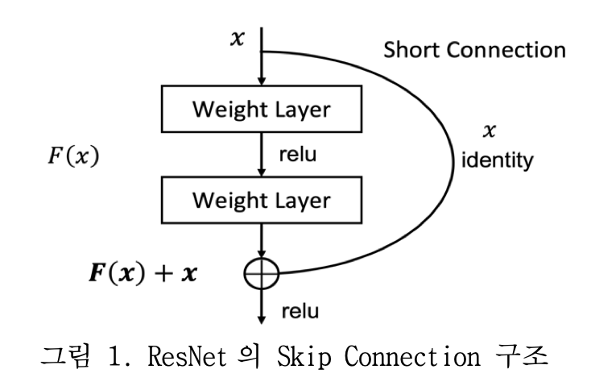
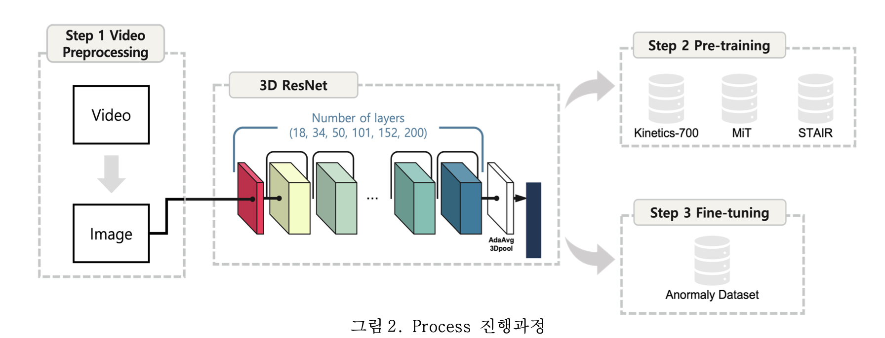
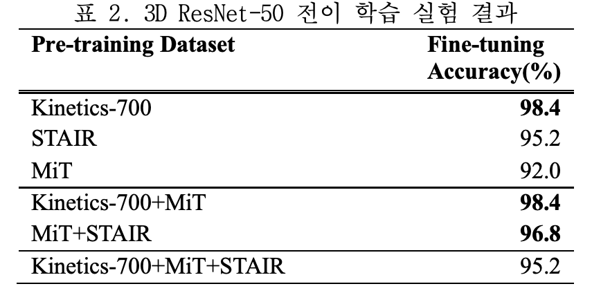
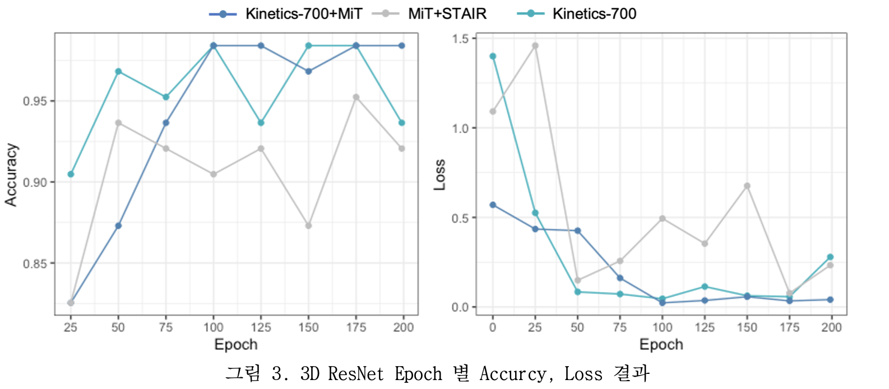
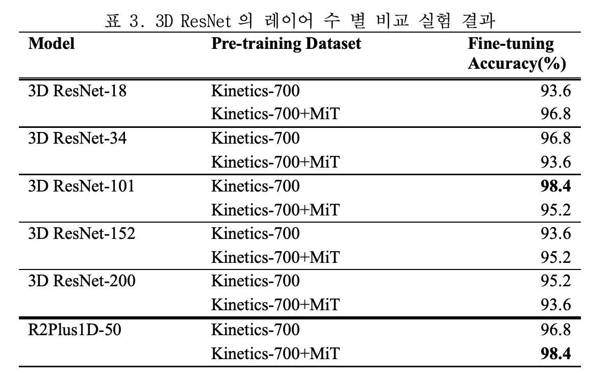

# 2022-2-CECD3-oneshot-12

주제 : 유치장 속 이상행위자 탐지 연구

## Abstract

Anomaly Detection 이란 Video의 전체 프레임에서 이상 행위자를 탐지하는 task이다. Anomaly Detection 연구에서는 3D ResNet 모델이 베이스라인으로 사용되며, 이는 2D-ResNet의 Conv가 3D로 전환된 구조이다. 본 연구에서는 전이 학습 방법을 통해 3D ResNet으로 이상 행위자를 탐지하는 연구를 수행하였다. Kinetics-700, Moments in Time(MiT), STAIR Action(STAIR) 3가지 데이터 셋으로 사전 학습 후, Anomaly 데이터셋으로 전이 학습하였다. 각 데이터셋 별로 비교 실험을 진행하였으며, 추가적으로 모델의 레이어 수를 다르게 구성하여 정확도를 측정하였다. 실험 결과 3D ResNet50 모델에서 Kinetics-700, MiT 데이터셋으로 사전 학습 후 Anomaly 데이터셋으로 전이 학습한 경우에 학습 안정성이 우수하였으며, 정확도 또한 가장 높은 수치를 나타냈다. 

## Introduction

Anomaly Detection은 2D 프레임의 시퀀스인 Video Clips에서 이상 행위자를 탐지하는 연구이다.[1] 최근 Anomaly Detection 연구에서는 2D ConvNet에 시간 축이 추가된 3D ConvNet[2] 모델을 적용하여, 높은 성능을 내는 모델들이 등장하고 있다. 하지만 3D ConvNet의 경우 네트워크의 레이어 깊이가 깊어짐에 따라 높은 계산 비용과 메모리가 발생하는 한계점이 존재한다.[3] 
3D ResNet은 2D ResNet의 2D ConvNet을3D  ConvNet으로 확장한 구조이다. Skip Connection을 통해 모델이 레이어 수가 많아짐에 따라 발생하는 문제를 보완한다. 본 연구에서는3D ResNet을 활용하여, 네트워크의 깊이 별로 이상행위를 탐지  실험을 진행하였다. Anomaly 데이터셋의 경우 촬영을 통해 구축하였으며, 규모가 작은 점을 고려하여 Kinetics-700[4], MiT[5], STAIR[6] 데이터셋을 통해 사전 학습한 가중치를 사용하였다. 비교 실험 결과 3D ResNet-50 모델에서 Kinetics-700과 MiT 데이터셋으로 사전 학습 후, Anomaly 데이터셋으로 전이 학습한 경우에 훈련 안정성과 정확도가 가장 높게 나타났다. 

## Related Works

### Transfer learning

전이 학습이란 특정 task로 학습되었던 네트워크를 다른 데이터셋 혹은 다른 task에 적용하여 사용하는 방법이다.[7] CNN(Convolutional Neural Network) 기반의 딥러닝 모델의 경우 훈련 시 다량의 데이터가 필요하다. 전이 학습을 이용하면 규모가 큰 데이터셋으로 훈련된 모델의 가중치를 사용할 수 있다. 결과적으로 전이 학습이 적용되지 않은 모델보다 비교적 빠르고, 높은 정확도를 달성할 수 있다. 

### 3D ResNet

3D ResNet의 3D ConvNet은 2D ResNet의 2D ConvNet이 3D 형태로 확장된 구조이다. 2D 형태의 이미지에 Spatio-Temporal 정보가 포함된 Video 형식의 데이터를 처리하기 위한 형태를 갖는다.[8] 2D 기반의 이미지 데이터에서 3D 기반의 동영상 데이터를 처리할 수 있는 형태로 변환된 구조이다. 

3D ResNet은 2D ResNet과 마찬가지로 Skip Connection을 사용하여, 연산량을 감소시킨다. 모델에서 레이어 수를 늘려 모델의 깊이가 깊어질 경우 연산량이 증가하고 정확도가 감소하는 문제가 발생한다.[9] Skip Connection은 레이어의 특정 부분에서의 입력을 출력 부분에 연결시켜 이러한 문제를 해결한다.[10] 입력되는 정보가 출력 부분에서 한 번 더 참고되기 때문에 기존과 달리 연산량이 감소하고, 정확도가 높아지게 된다.

---

## Model Architecture

### Video Preprocessing
3D ResNet 모델에 데이터를 입력하여 훈련을 진행하기 위해 동영상 데이터를 이미지 형태로 전처리한다. 사전 학습 과정에서 사용할 Kinetics-700, MiT, STAIR Action 데이터셋과 전이 학습 과정에서 사용할 이상행위 데이터셋을 frame 단위로 추출하여 3D ResNet 모델에 입력되기 위한 전처리 과정을 진행한다.!

### 3D ResNet Pre-Training

3D ResNet 모델의 사전 학습을 진행한다. Kinetics-700, MiT, STAIRE Action데이터셋을 통해 3D ResNet을 훈련한다. 3가지 데이터 셋 조합 별로 사전 학습을 진행한다. 3D ResNet 레이어 깊이의 경우 18, 34, 50, 101, 152, 200 별로 설정하여 모두 사전 학습을 진행한다. 

### 3D ResNet Fine-tuning

사전 학습된 3D ResNet모델을 대상으로 전이 학습을 진행한다. Kinetics-700, Mit, SATIRE Action 데이터 셋으로 훈련된 가중치 값을 이상행위자 데이터셋을 반영할 수 있도록 업데이트한다. 이상행위자 데이터 셋은 Normal, Selfharm 두 가지 형태로 라벨링 되어 있기 때문에 3D ResNet의 FC Layer 출력 형태를 2로 설정하여 전이 학습한다. 

---

## Result

### Dataset

사전 학습으로 사용한 데이터셋은 Kinetics-700, MiT, STAIR Action으로 총 3가지이다. 3가지 데이터셋을 통해 3D ResNet 모델을 훈련하여, 각 데이터셋의 특징이 반영된 가중치를 계산한다.
전이 학습으로 사용한 Anomaly 데이터셋의 경우 유치장 환경에서 영상을 직접 촬영하여 구축하였다. 정상행위가 담긴 영상은 Normal, 이상행위가 담긴 영상은 Selfharm으로 라벨링하였다. Selfharm 영상의 경우 벽에 머리를 박거나 스스로 자해행위를 하는 행동을 촬영하였다. 

본 실험에서는 Kinetics-700, MiT, STAIR Action 데이터셋의 조합 별로 사전 학습을 진행한 후 Anomaly 데이터셋으로 전이 학습을 진행하여 정확도를 측정하였다. 또한 3D ResNet의 레이어 수를 다르게 구성하여 추가 실험을 진행하였다.

표 2은 3D ResNet-50 모델로 전이 학습한 실험 결과이다. Kinetics-700, MiT, STAIR 각각 하나의 데이터 셋으로 실험한 결과와 두 개의 데이터셋으로 조합 후 결과, 3가지 모두 학습한 결과이다. Kineti-cs-700, Kinetics-700+MiT, MiT+STAIR 데이터셋에서 높은 정확도 값이 나타났으며, 그중 Kinetics-700과 Kinetics-700+MiT에서 정확도 값이 가장 높았다.  

그림 3은 3D ResNet-50 모델을 Kinetics-700+MiT, MiT+STAIR, Kinetics-700 조합으로 사전 학습 후 Anomaly 데이터셋으로 전이 학습한 결과이다. Kinetics-700+MiT로 사전 학습한 경우가 다른 두 데이터셋 조합의 경우보다 훈련 안정성이 높은 것을 확인할 수 있다. Accuracy 결과의 경우 모든 Epoch에서 MiT+STAIR 보다 높은 정확도가 나타났으며, Kinetics-700와 비교했을 때 0.95 이상의 정확도를 유지하는 것을 볼 수 있다. 그림 3의 Loss 결과를 통해서는 Kinectis-700+MiT 조합이 다른 두 경우 보다 Loss 값이 작으며, 적은 수치를 유지하는 것을 확인할 수 있다.

표 3는 3D ResNet의 레이어 수 별로 진행한 비교 실험 결과이다. 18, 34, 101, 152, 200 개의 레이어를 탑재한 3D ResNet 모델의 정확도를 나타내었다. 데이터셋의 경우 Kinetics-700과 Kinetics-700+MiT로 사전 학습을 진행하였으며, 추가적으로 R2Plus1D 모델을 비교하였다. 실험 결과 152 레이어 수를 가진 3D ResNet와 R2Plus2D에서 98.4로 가장 높은 정확도가 나타났다. 이는 표 2 결과를 통해서 ResNet-50의 Kinetics-700+MiT의 조합과 동일한 값임을 확인할 수 있다.

실험 결과 3D ResNet-50에서 Kinetics-700+MiT 데이터셋으로 사전학습한 경우 정확도가 98.4로 가장 높은 것을 확인하였다. 그리고 Accuracy, Loss 실험 결과 학습 안정도가 뛰어난 것을 확인하였다. 또한  모델의 레이어 수 별 실험 결과를 통해서 3D ResNet-50 모델의 성능이 가장 우수하거나 동일한 것을 확인하였다. 

---

## Conclusion

본 연구에서는 3D ResNet을 활용하여, 동영상 속 이상 행위자를 탐지하는 Anomaly Detection 연구를 수행하였다. 이상행위 행동이 촬영된 Anomaly Dataset을 구축한 후, 전이 학습 방법을 사용해 실험을 진행하였다. Kinetics-700, MiT, STAIR 데이터셋을 통해 사전 학습을 하였으며, 이후 Anomaly Dataset으로 전이 학습을 진행하였다. 실험 결과 Kinetics-700과 MiT 데이터셋을 통해 사전 학습할 경우 정확도가 가장 높았으며, 학습의 안정성 또한 우수한 것을 확인하였다. 그리고 3D ResNet의 레이어 깊이를 다르게 구성하여, 비교 실험 진행 결과 50개의 레이어를 탑재했을 때 가장 높은 정확도를 보이는 것을 확인하였다.

---

### Reference

* https://github.com/kenshohara/3D-ResNets-PyTorch
